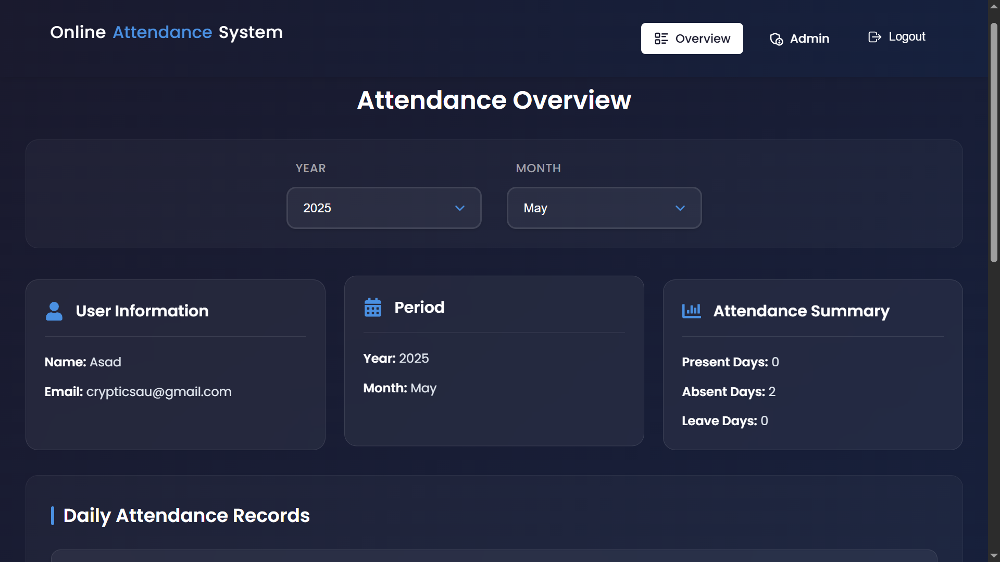

# Online Attendance System

## Final Year Project

<div align="center">
  
  
  <p style="font-size: 1.2em; color: #333; margin: 20px 0;">A modern, efficient, and user-friendly attendance management system built with the MERN stack.</p>

  <div style="margin: 25px 0;">
    
    
    
    
    
  </div>
</div>

## 📋 Table of Contents

1. [Project Overview](#project-overview)
2. [Project Structure](#project-structure)
3. [Features](#features)
4. [Project Scope](#project-scope)
5. [References](#references)
6. [Acknowledgments](#acknowledgments)

## Project Overview

The Employee Attendance System is a comprehensive web-based solution developed as a final year project. It addresses the challenges of traditional attendance management systems by providing a modern, efficient, and user-friendly platform. The system is built using the MERN stack (MongoDB, Express.js, React.js, Node.js) and implements industry-standard security practices and best development methodologies.

### Key Highlights

- Real-time attendance tracking
- Role-based access control
- Responsive design for all devices
- Secure authentication system
- Comprehensive reporting system

## Project Structure

```
Employee-Attendance-System-MERN/
├── backend/
│   ├── middleware/                     # Authentication & validation
│   ├── models/                        # Database models
│   ├── routes/                        # API routes
│   ├── config/                        # Configuration files
│   ├── utils/                         # Utility functions
│   └── server.js                      # Server entry point
├── frontend/
│   ├── public/                        # Static files
│   ├── src/
│   │   ├── assets/                    # Images & fonts
│   │   ├── components/                # Reusable components
│   │   ├── pages/                    # Page components
│   │   ├── context/                  # Context providers
│   │   ├── hooks/                    # Custom hooks
│   │   ├── utils/                    # Utility functions
│   │   ├── services/                 # API services
│   │   ├── styles/                   # Global styles
│   │   ├── App.js                    # Root component
│   │   └── index.js                  # Entry point
│   └── package.json                  # Dependencies
└── README.md                         # Project documentation
```

## Features

### Admin Features

1. **User Management**

   - Add/Edit/Delete users
   - Role assignment
   - Profile management

2. **Attendance Management**

   - View all records
   - Generate reports
   - Export data

3. **Dashboard**
   - Analytics overview
   - Attendance statistics
   - User activity

### Employee Features

1. **Attendance**

   - Mark attendance
   - View history
   - Request leave

2. **Profile**
   - Update information
   - View statistics
   - Download reports

### General Features

1. **Authentication**

   - Secure login
   - Password reset
   - Session management

2. **Responsive Design**
   - Mobile-first approach
   - Cross-browser compatibility
   - Progressive enhancement

## Project Scope

### Current Scope

- Web-based attendance management
- Real-time attendance tracking
- Role-based access control
- Basic reporting system
- User profile management

### Future Scope

1. **Features**

   - Mobile application
   - Biometric integration
   - Advanced analytics
   - Leave management system
   - Payroll integration

2. **Technical**

   - Microservices architecture
   - Real-time updates
   - Cloud deployment
   - API documentation
   - Automated testing

3. **Security**
   - Two-factor authentication
   - Audit logging
   - Advanced encryption
   - Regular security audits

## References

1. **Documentation**

   - [React Documentation](https://reactjs.org/docs)
   - [Node.js Documentation](https://nodejs.org/docs)
   - [MongoDB Documentation](https://docs.mongodb.com)

2. **Tutorials**

   - [MERN Stack Tutorial](https://www.mongodb.com/mern-stack)
   - [React Router](https://reactrouter.com/docs)
   - [Express.js Guide](https://expressjs.com/guide)

3. **Tools**
   - [VS Code](https://code.visualstudio.com)
   - [Postman](https://www.postman.com)
   - [MongoDB Compass](https://www.mongodb.com/products/compass)

## Acknowledgments

- University faculty for guidance and support
- Open source community for their invaluable contributions
- Project supervisor for continuous feedback and direction
- Fellow students for testing and providing valuable feedback
- Family and friends for their support throughout the project

## License

This project is licensed under the MIT License - see the [LICENSE](LICENSE) file for details.
